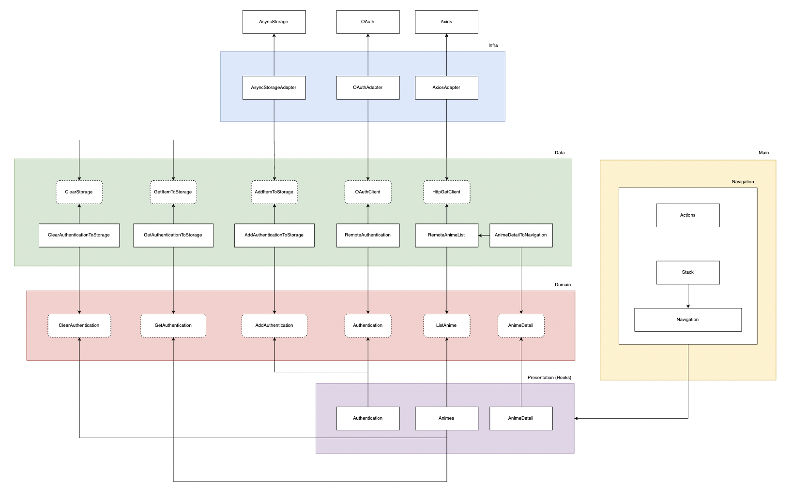
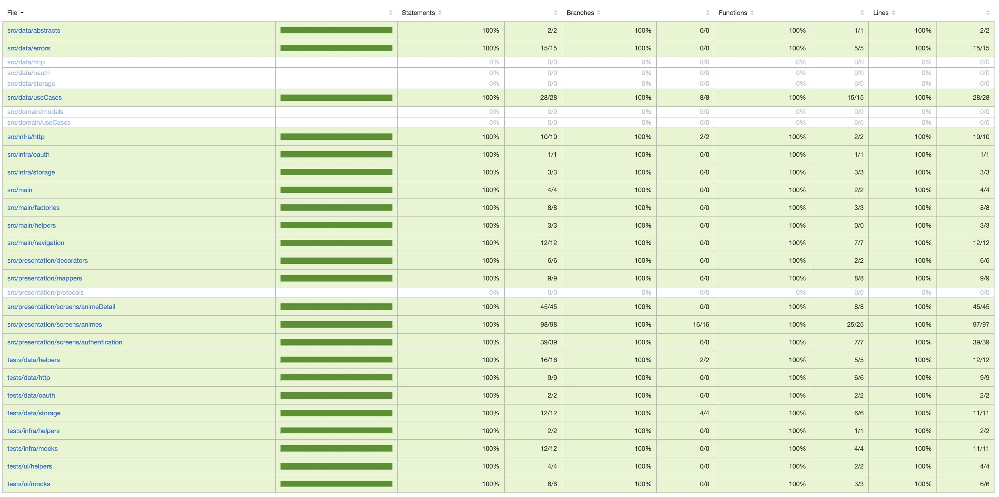
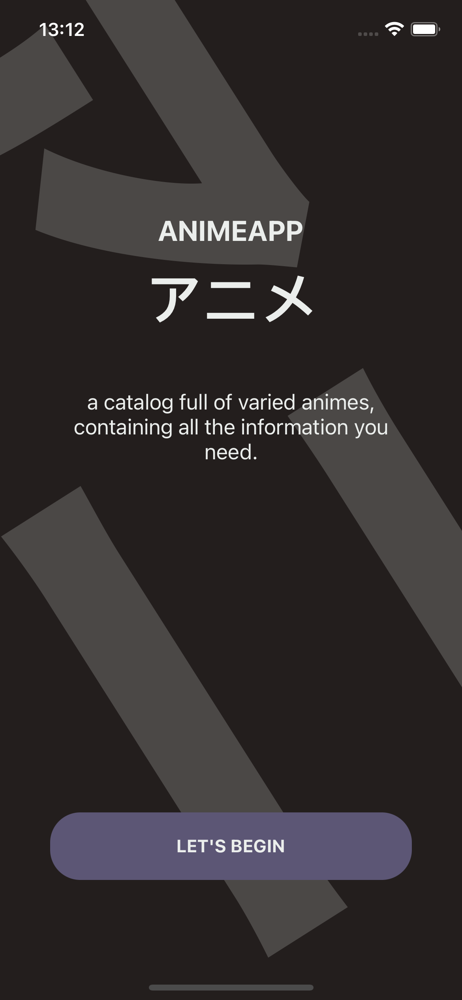
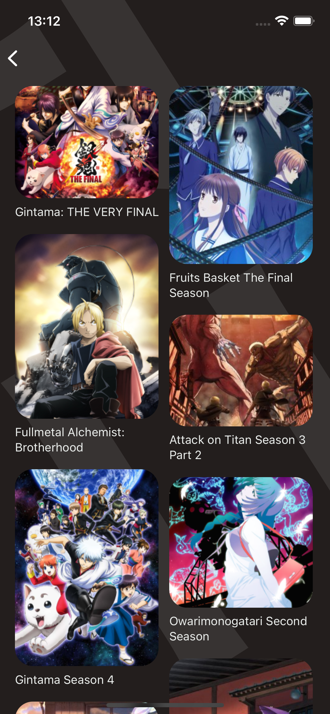
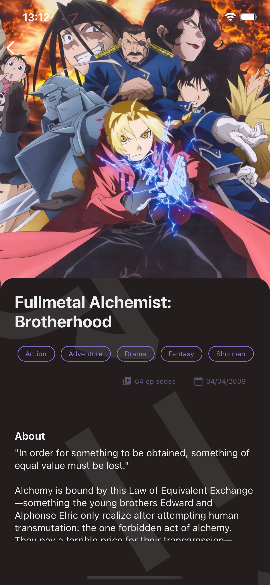
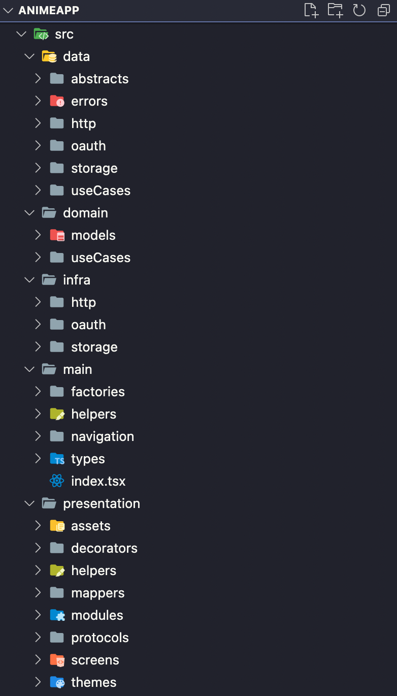

# AnimeApp-TDD-CleanArch

## This application was developed with the focus of putting into practice the methodology of TDD (Test Driven Development), Clean Architecture and Architecture Pattern MVP (Model View Presenter).

### **Before we start, let's learn a little about:**

> *Test-driven development (**TDD**), also called test-driven design, is a method of implementing software programming that weaves unit testing, programming, and refactoring into source code. (font: [https://searchsoftwarequality.techtarget.com/definition/test-driven-development](https://searchsoftwarequality.techtarget.com/definition/test-driven-development))*
> 

> ***Clean Architecture** is a software architecture proposed by Robert Cecil Martin (or Uncle Bob, as he is better known) that aims to standardize and organize the developed code, favoring its reusability, as well as technology independence. (font: [https://www.zup.com.br/blog/clean-architecture-arquitetura-limpa](https://www.zup.com.br/blog/clean-architecture-arquitetura-limpa))*
> 

> *The **MVP** pattern is very similar to the MVC pattern. In this architectural pattern “p” represents the presenter. So it has parts like MVC, but here the controller is replaced by the presenter, although they don't perform the same function. The presenter can address all UI events on behalf of the view. It takes input from users, proceeds with the data in the Model, and then transforms the results back in the View. (font: [https://medium.datadriveninvestor.com/model-view-presenter-mvp-5c3439227f83](https://medium.datadriveninvestor.com/model-view-presenter-mvp-5c3439227f83))*
> 

### About implementation

For the development, **React Native** with **Typescript** was used, where the implementation was mainly focused on the IOS. As already mentioned, the main objective of this application is to put into practice good concepts of clean architecture and test-based development, covering 100 percent of the code with unit tests, in addition to containing integration tests, I will not go into much depth, but we will go through the main points of development.

**About architecture**

As you may already know, it was chosen to use the MVP (Model View Presenter) architecture pattern with a focus on a Clean Architecture.

Briefly, we followed the concepts of Clean Architecture where we started the development in the Domain and added the other layers around it, always pointing towards the Domain, following the flow of the layers. Where the dependencies of libraries etc., are in the outermost layer connecting through Adapters.

In addition to the concept of Clean Architecture, we use the MVP pattern, where for the case of React Native we do not give up the use of hooks, thus adapting the pattern a little to suit our case, so Presenter would do both the role both the presenter and the UI.

This was the Architecture diagram built to follow as a basis for development:



**About the Tests**

Also as already mentioned, we follow the test-driven development methodology, where the unit tests follow the same development architecture, with the only difference that instead of testing only Presentation, we decided to divide these tests into UI and Presentation. Also, by using TDD, it was easier to cover the project with 100 percent tests, in addition to writing some integration tests.

To write the tests, **jest** and **react-native-testing-library** were used.



### About the project

AnimeApp is an application that consumes information from [AniAPI](https://aniapi.com/), where you can receive a list of the most diverse animes, in addition to being able to view more detailed information.

<p align="flex-start">
  
  
  
</p>

The development focused only on IOS, but theoretically it is to run on Android without many problems.

About the folder structure:



### Build

Now the grand finale, in the root of the project, run:

```bash
yarn
```

So depending on the platform you want to run the project on, just run:

```bash
yarn android
```

```bash
yarn ios
```

### Thanks and Contact

Finally, I want to thank [Rodrigo Manguinho](https://github.com/rmanguinho) for having served as a basis for the knowledge applied here, mainly through the video [Clean Architecture in React.Js](https://www.youtube.com/watch?v=iUQVZHzqGuc&t=1166s).

To contact me, you can use:
- Instagram: [@marlonbelomarques](https://www.instagram.com/marlonbelomarques)
- Linkedin: [Marlon Marques](https://www.linkedin.com/in/marlon-marques-0b509813b/)
